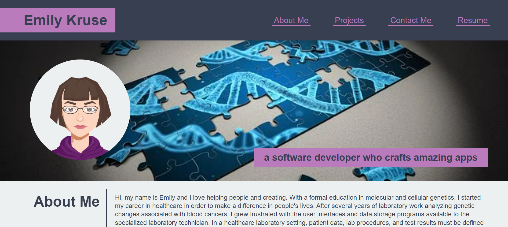
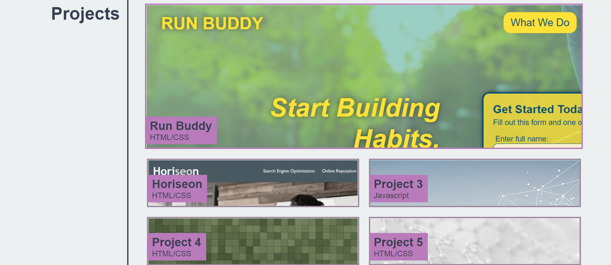

# Emily's Portfolio

## Description

I made this portfolio webpage to showcase some of my work as a developer. I hope hiring managers can view it and learn about me as an individual and a professional so that I can find a developer job that would be a good fit for me. With HTML and CSS, I have made a responsive web design using flexbox and media queries, as well as sharing my story and projects I have worked on. Flexbox is an extremely useful way to fill space aesthetically across a wide range of screen sizes.

This project has the distinction of being my first solo project I built from the ground up. I am very proud of everything I have learned so far in a short amout of time and look forward to continuing my life-long learning journey.

## Website
[https://emilyk221.github.io/Emilys-Portfolio](https://emilyk221.github.io/Emilys-Portfolio/)